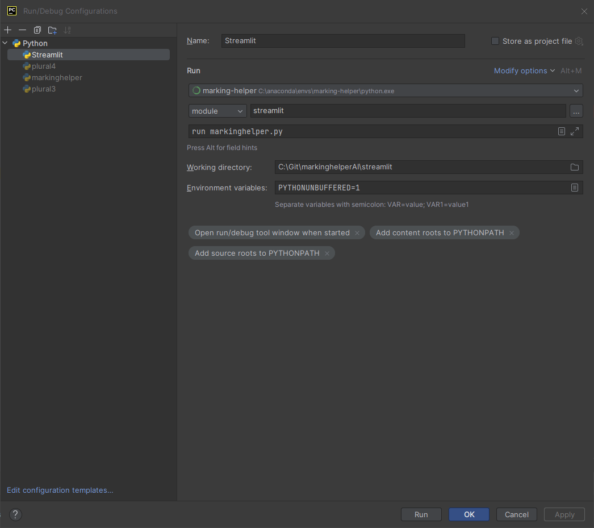

# Portrait-Pablo-the-Poemsmith
A demo of the GPT-4-Vision model, linked with OpenAI's Text-To-Speech AI


### Public Demo

Sadly the demo is only available to those with a password (since it's my personal API key). Setup locally to try it out!

For those with a password, the demo is available at: https://portrait-pablo-the-poemsmith.streamlit.app/

### How to setup for local development

1. `pip install -r requirements.txt`
2. Create a file called secrets.toml inside the .streamlit folder. (streamlit/secrets.toml)
   - See below for the format of the file
2. `streamlit run app.py`

### secrets.toml format

```
api_key=""
password=""
known_users=""
```
- `api_key`: Your OpenAI API key
- `password`: The password for people accessing the demo
- `known_users`: A list of users who can access the demo without a password when logged into their Streamlit account

### Running via PyCharm

Streamlit setup:

